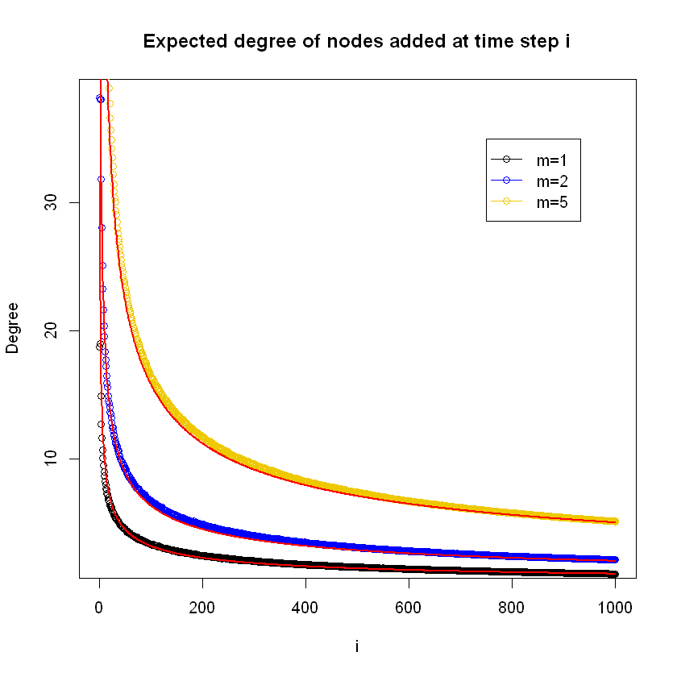
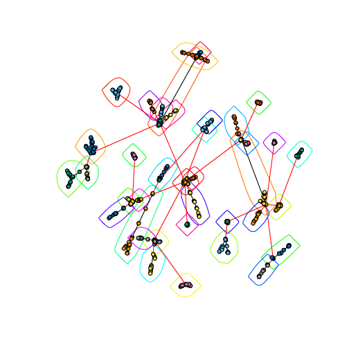
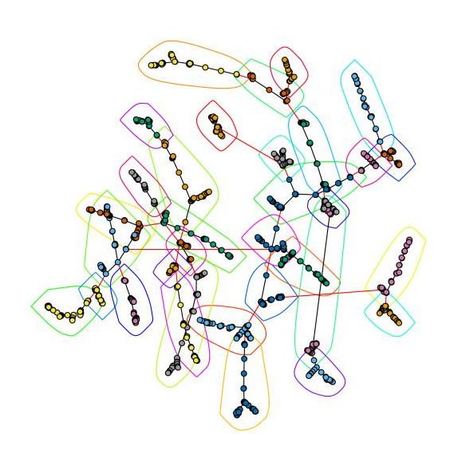
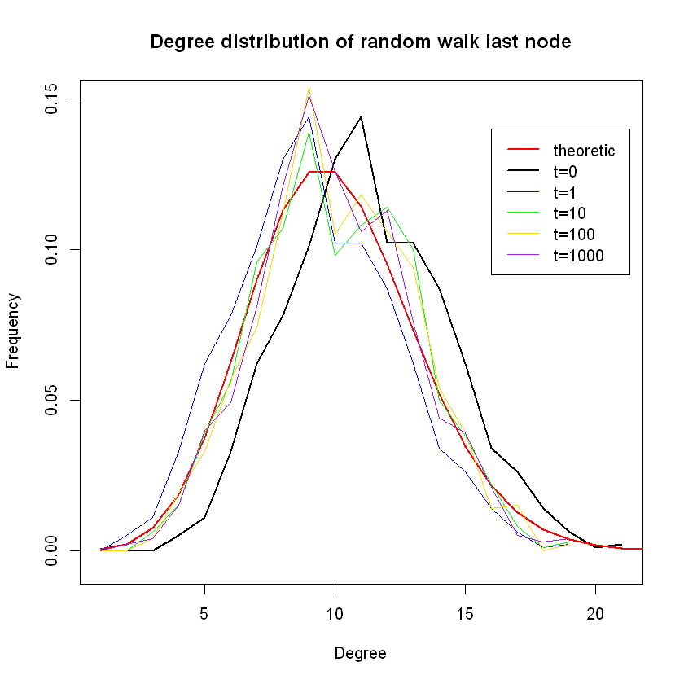
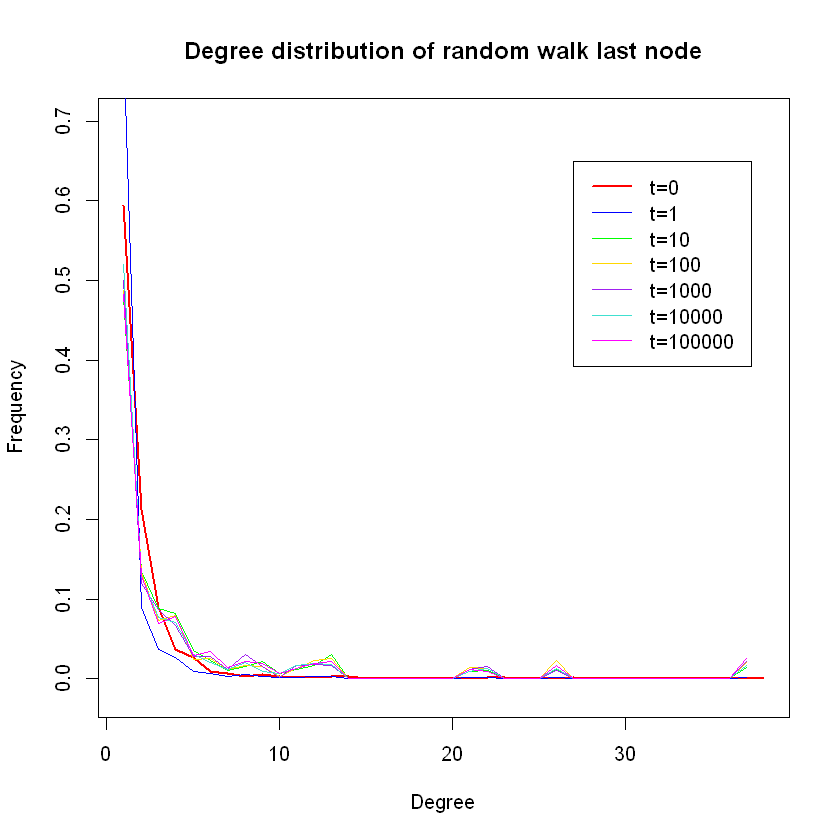

# Project 1: Random Graphs and Random Walks

Main code: [Jupyter Notebooks](https://github.com/Qiong-Hu/Large-Scale_Social_and_Complex_Networks/tree/master/Project1/script)

Full report: [report.pdf](project1_report.pdf)

Coding language: R

R library used in implementation: igraph

 

## Objectives

- To measure various properties and analyze community structure of large random networks generated by two different models.
- To implement random work on large random networks to simulate Google's PageRank algorithm.

## Instructions

### Part 1 Generating Random Networks

1. Create undirected random networks using Erdős–Rényi (ER) model with different edge probabilities.

    (1) Analyze number of nodes and graph diameter of Giant Connected Component (GCC).

    (2) Observe the relationship between the expected size of the GCC and number of nodes in the ER network.

    The observation is that the relationship depends on whether the average degree of nodes c is smaller, equal to, or larger than 1, the trend ranges from logarithmic to linear.

      

2. Create undirected random networks using Preferential Attachment (PA) model.

    Mathematically calculate the expected number of nodes with regards to their age, and simulationally proved it to be correct.

    

3. Create modified Preferential Attachment (PA) networks that penalizes the age of a node.

    Visualization of community structure of two different models of random networks:

     

### Part 2 Random Walk on Networks

1. Let a random walker start from a randomly selected node, calculate the shortest path length to the destination at each step.

2. Compare the degree distribution of the last node after different step numbers.

     

    (Left: ER model; Right: PA model)

3. Implement random walk on large random network to simulate Google’s PageRank algorithm.

 

Full report see: [report.pdf](project1_report.pdf)
