# Project 2: Social Network Mining

Main code: [Jupyter notebooks](https://github.com/Qiong-Hu/Large-Scale_Social_and_Complex_Networks/tree/master/Project2/script)

Full report: [report.pdf](project2_report.pdf)

Coding language: R

R package used in implementation: igraph

Data source: Facebook dataset, Google+ dataset

 

## Objectives

In this project, we will study the various properties of social networks: undirected social network (Facebook), and directed social network (Google+).

## Instructions

### Facebook Network

1. Study structural properties of the Facebook network, including **connectivity** and **degree distribution**. The graph of the network is as follows:

    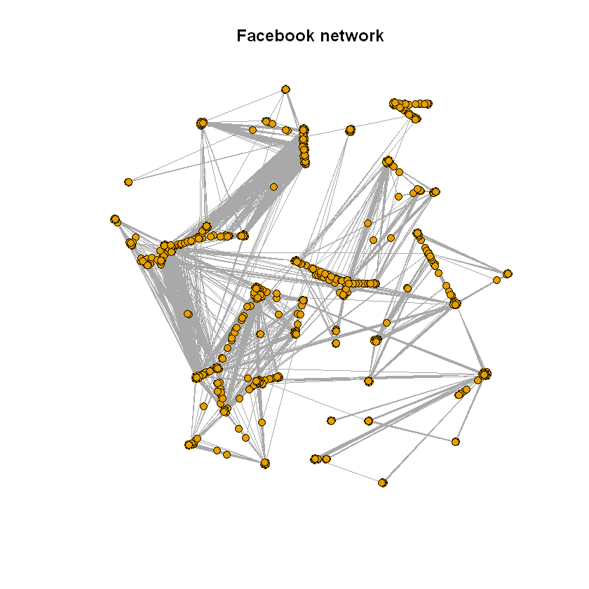

2. Study structural properties of personalized network of random nodes and core nodes, using **Fast-Greedy**, **Edge-Betweenness**, and **Infomap** community detection algorithms.

    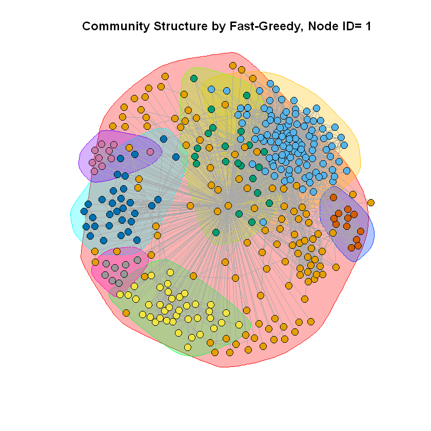 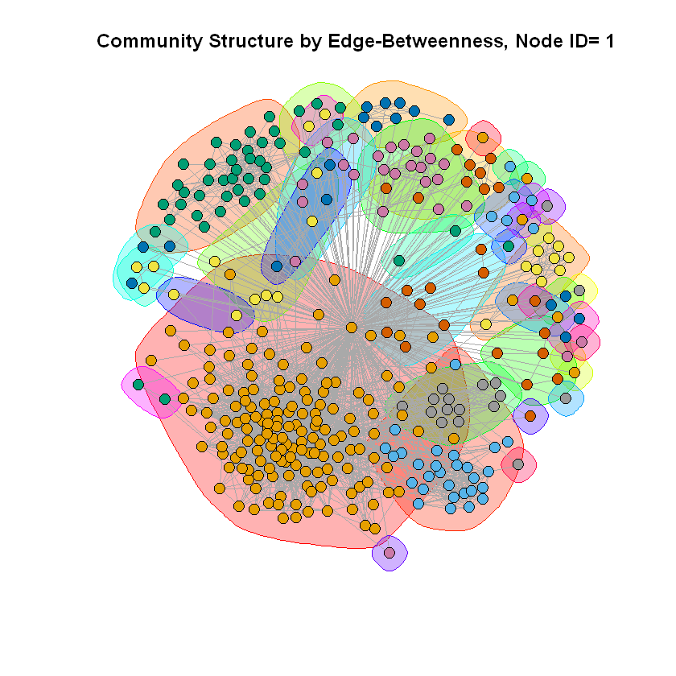 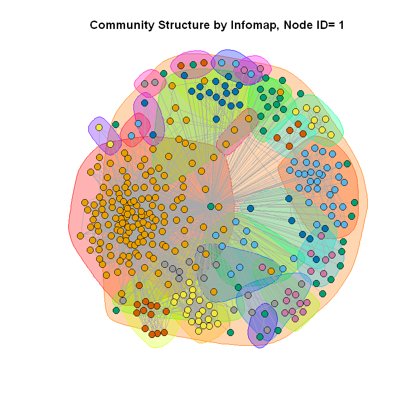

    In most cases, the difference of the modularity scores between Edge-Betweenness and Infomap community detection algorithms are smaller than the difference between these two and Fast-Greedy algorithm.

3. Explore characteristics of nodes in the personalized networks using **embeddedness** and **dispersion**.

    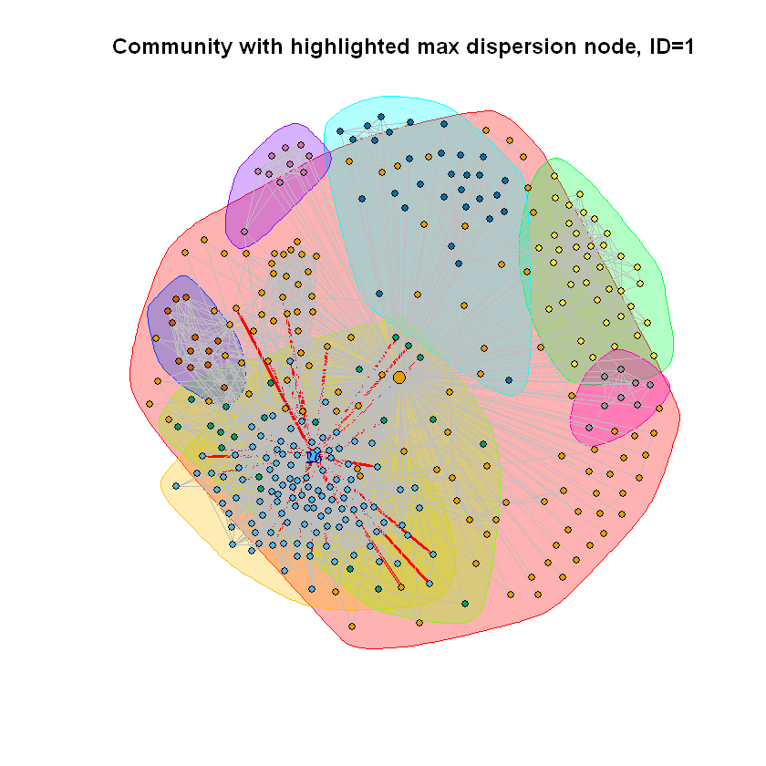 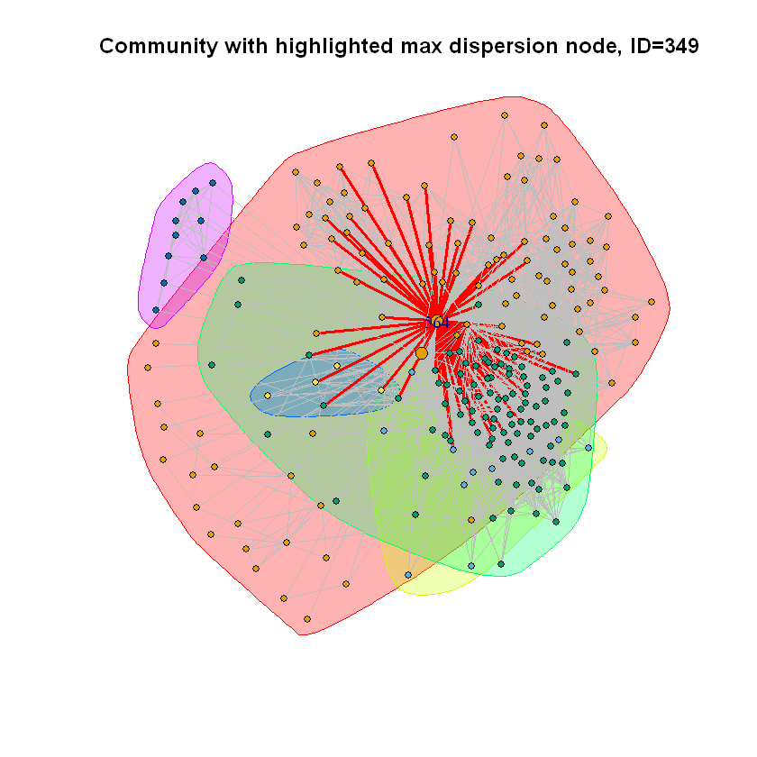 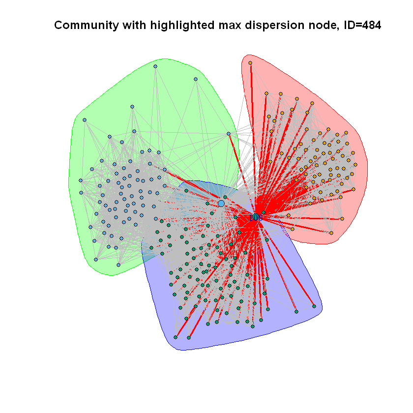

    The nodes with maximum dispersion and the core node are marked in a larger size, and the incident edges of that max dispersion node are highlighted in red thick lines.

    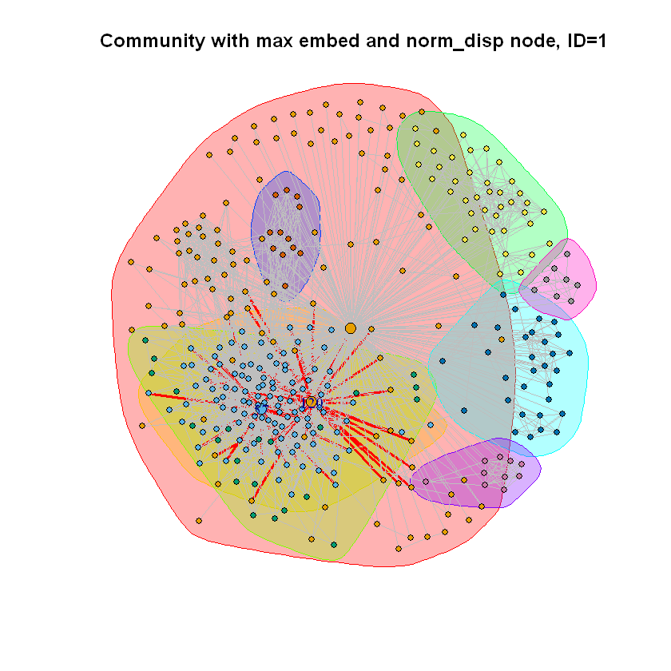 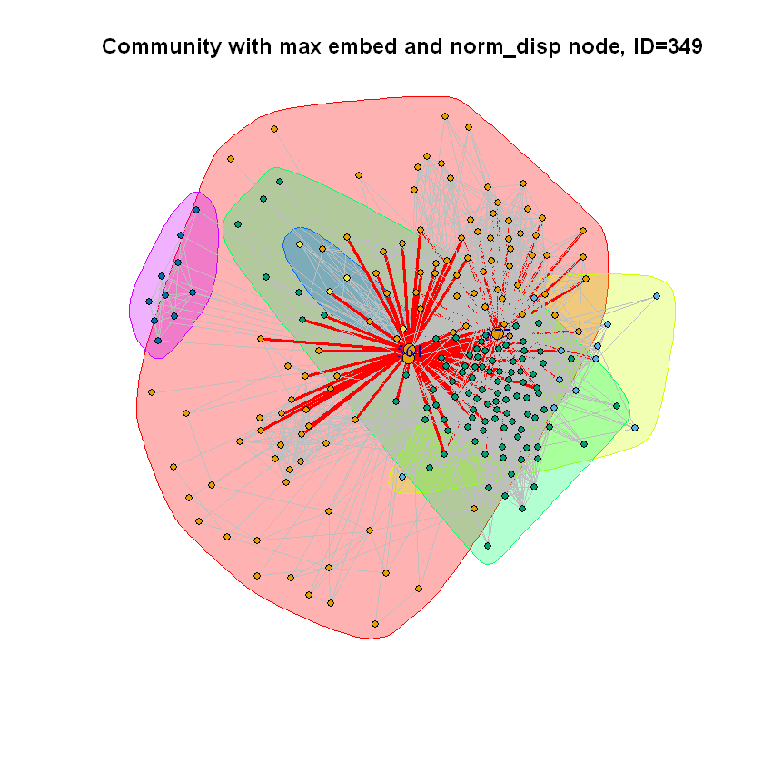 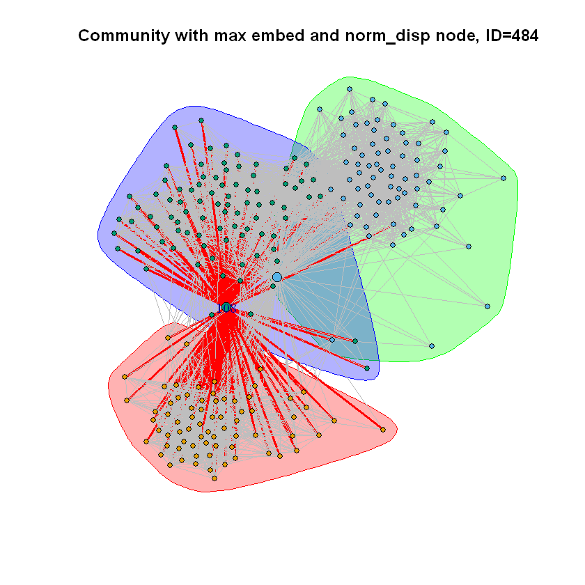

    The nodes with maximum embeddedness and normalized dispersion, along with the core node, are marked in a larger size. The incident edges are highlighted in red thick lines.

4. Implement friend recommendation in personalized networks using neighborhood-based measures, including **common neighbor measure**, **Jaccard measure**, and **Adamic-Adar measure**.

    To apply and evaluate the friend recommendation algorithms, we randomly delete nodes and edges in the target graph with a probability of 0.25. Then with the friend recommendation algorithms, we recommend the same number of friends that got deleted to the target node. Afterward, we compare the delted list of node and the recommended list of node to assess the accuracy of each algorithm.

5. Evaluate the performances of three different types of friend recommendation algorithms using an average accuracy measure.

    | Node ID | Common Neighbors | Jaccard | Adamic-Adar | Average |
    |:-------:|:----------------:|:-------:|:-----------:|:-------:|
    |497|0.304|0.161|0.352|0.272|
    |579|0.990|0.940|0.990|0.973|
    |601|0.905|0.855|0.888|0.882|
    |616|0.821|0.771|0.836|0.810|
    |619|0.438|0.530|0.416|0.461|
    |628|1.000|0.950|0.975|0.975|
    |644|0.889|0.903|0.897|0.896|
    |659|0.997|0.927|0.968|0.964|
    |660|0.994|0.945|0.988|0.975|
    |662|0.894|0.904|0.882|0.894|
    |663|0.946|0.918|0.973|0.946|
    |Average|**0.834**|**0.800**|**0.833**|0.823|

    The results show that all three of the algorithms have an average aaccuracy of over 80%. 

### Google+ Network

1. Explore the community structure of personal networks, and the relationship between circles and communities, defined by **homogeneity** and **completeness**.

    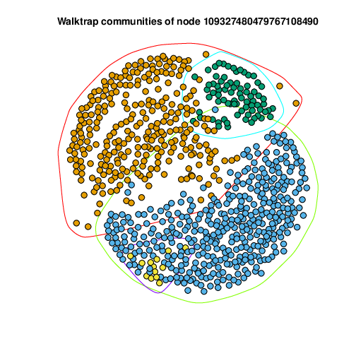 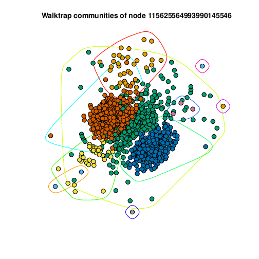 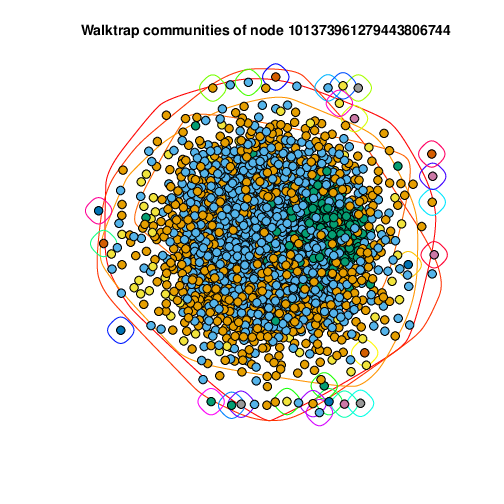

    For each ego graph, the community structure is extracted with the **Walk-trap** community detection algorithm and three examples are plotted above.

 

Full report see: [report.pdf](project2_report.pdf)
