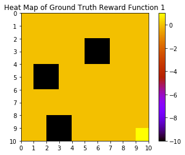

# Project 3: Reinforcement Learning (RL) and Inverse Reinforcement Learning (IRL) 

Main code: [Jupyter notebook](project3.ipynb)

Full report: [report.pdf](project3_report.pdf)

Coding language: Python

Python package used in implementation: numpy, matplotlib

 

## Objectives

In this project, we will implement the value iteration algorithm to learn the optimal policy of an agent navigating in a 2D environment. We will also explore the application of Inverse Reinforcement Learning (IRL) to extract an expert's reward function by observing the optimal policy of the expert.

## Instructions

### Reinforcement Learning (RL)

1. Model the environment of the agent by Markov Decision Process (MDP), by setting up the state-space, action set, transition probabilities, discount factor, and reward function.

     

    Visualization of reward function in two layouts.

2. Implement the initialization and estimation steps of the value iteration algorithm.

     

     

    Visualization of optimal state values when action error probablity  and .

### Inverse Reinforcement Learning (IRL)

1. Implement the IRL algorithm using Linear Programming (LP) formulation.

    (Left to right: ground truth reward function, extracted reward function using IRL, optimal state value from the extracted reward function)

      

      

2. Evaluate the performance of IRL algorithm by comparing the extracted reward function and the ground truth reward function, and calculate the accuracy of optimal policy map.

     

    Comparison of optimal policy map.

    The accuracy in both circumstances are 92%. After changing a set of parameters, the highest accuracy can reach up to 97%.

 

Full report see: [report.pdf](project3_report.pdf)
