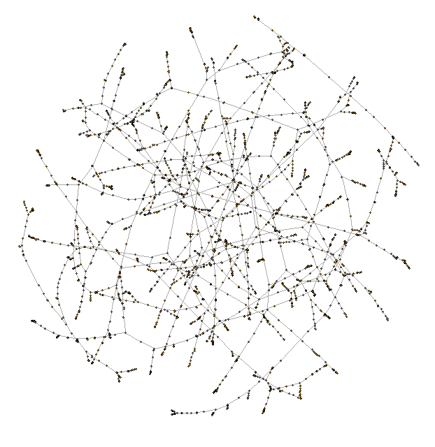
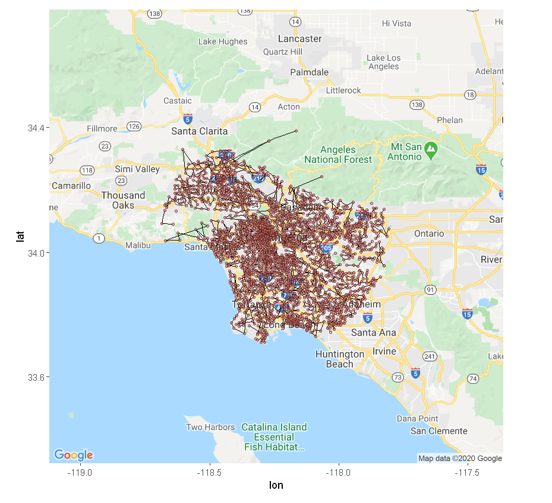
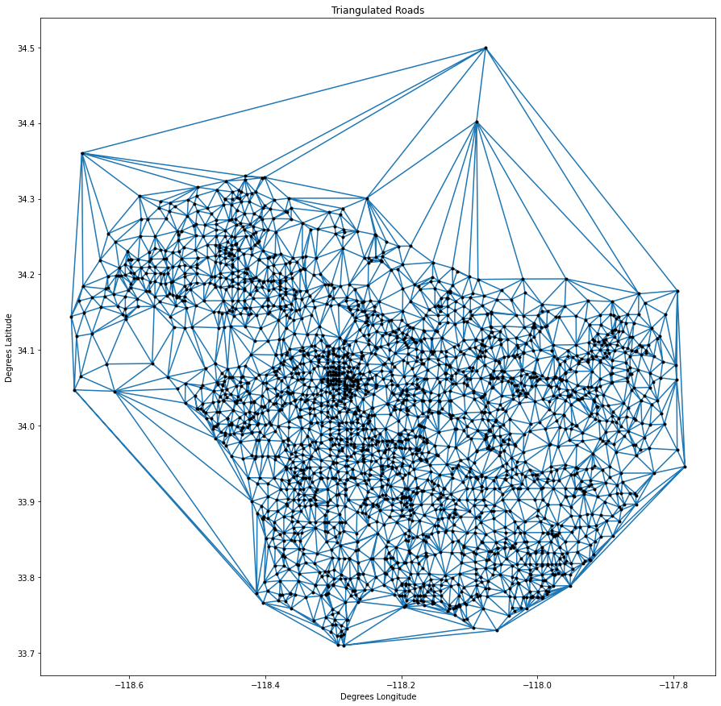
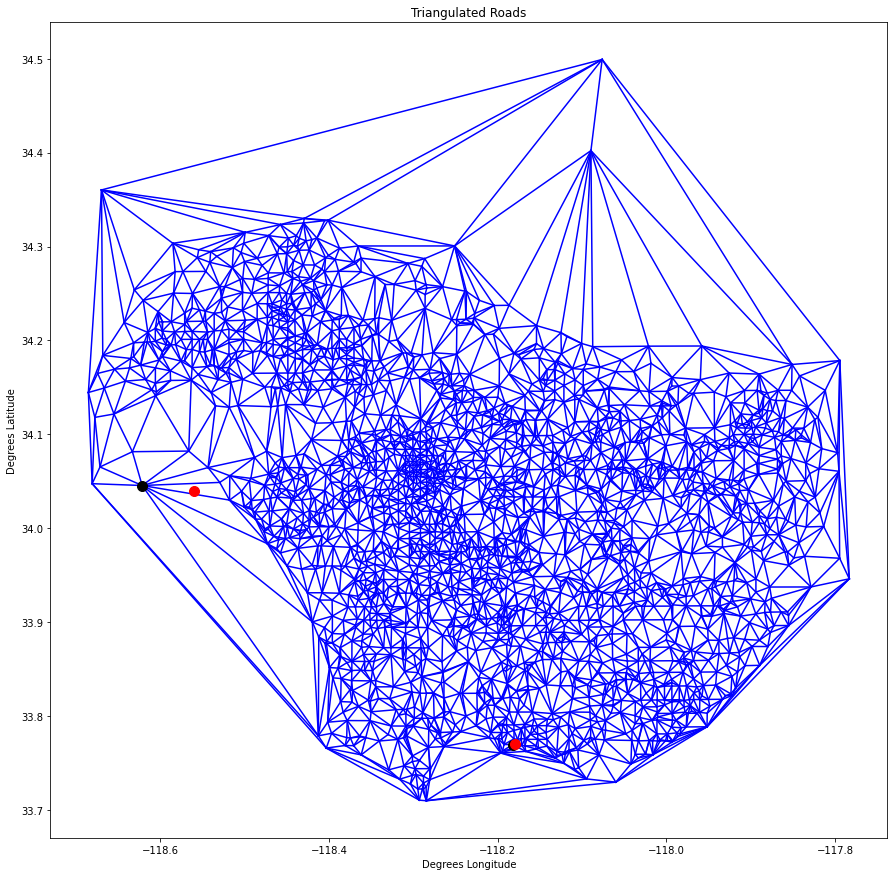
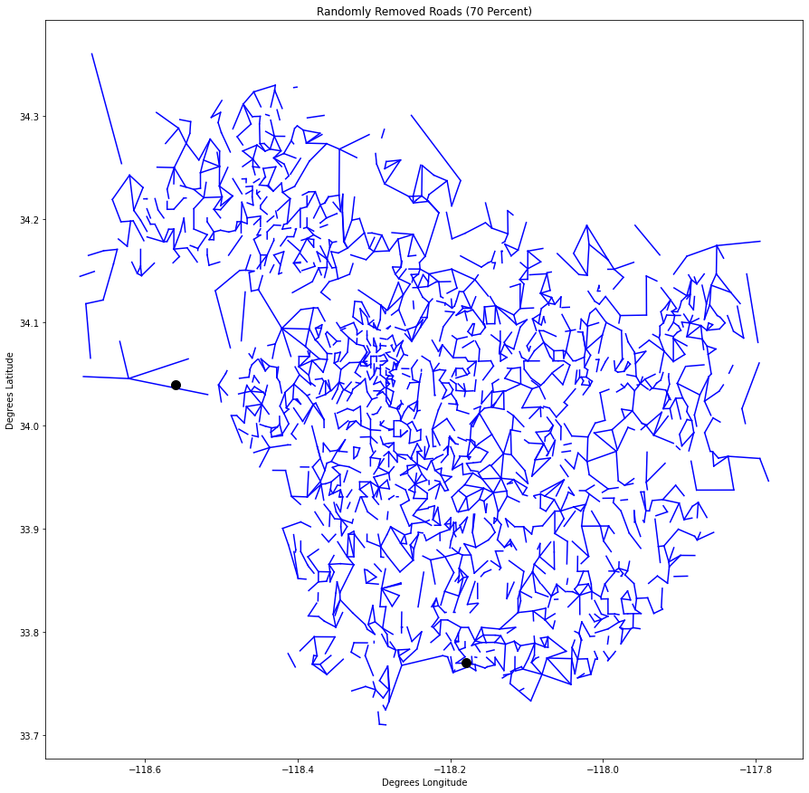
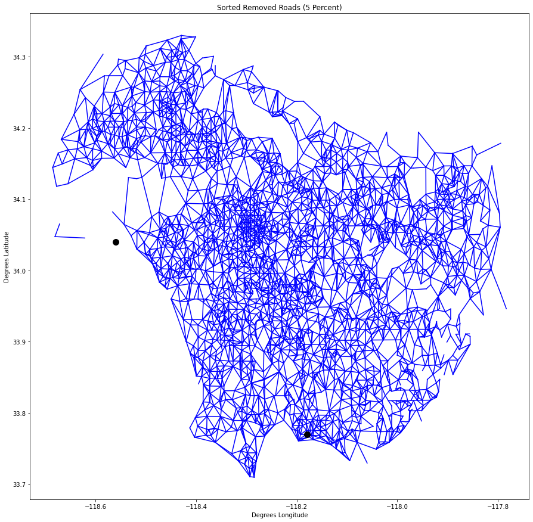

# Project 4: Graph Theory and Algorithms

Main code: [Jupyter notebooks](https://github.com/Qiong-Hu/Large-Scale_Social_and_Complex_Networks/tree/master/Project4/script)

Full report: [report.pdf](project4_report.pdf)

Coding language: R, Python

R package used in implementation: igraph, dplyr

Python package used in implementation: numpy, scipy, matplotlib, pandas, igraph

Data source: Yahoo Finance website, Uber Movement website for Los Angeles area

 

## Objectives

In this project, we will explore graph theory theorems and algorithms, by applying them on real data including resources from Yahoo Finance website and Uber dataset. In the first part of the project, we consider a particular graph modeling correlations between stock-price time series. In the second part, we analyse traffic data.

## Instructions

### Stock Market

1. Construct a correlation graph using correlation coefficient computed among stock-return time series data.

2. Extract the Minimum Spanning Tree (MST) of the correlation graph and interpret it.

    

3. Predict the market sector of an unknown stock, and evaluate the performance using sector clustering in MST.

    The best performance is an acerage accuracy of 81.4%.

### Transportation Dynamics

1. Preprocess the raw data by removing isolated nodes, construct MST from the largest connected component of the graph.

    

2. Find an approximation solution for the Traveling Salesman Problem (TSP) on the graph built from Uber dataset.

    

    (Visualization of the resulting trajectory with the optimized travelling time)

3. Generate a triangular mesh graph using Delaunay triangulation algorithm. The plotted triangulat mesh of the map is as below:

    

4. Analyse and estimate road traffic flow between Malibu and Long Beach.

    

    (The above is the triangular mesh plotted with the two targeting nodes shown in red.)

5. Define new traffic-related task: Simulate the influence of traffic block on the flow between certain places; estimate how many roads could be blocked before paralyzing the traffic in Los Angeles area and which ones are the most significan roads.

     

    Results show that the traffic would not be paralyzed until 70% random roads are blocked (Left) or top 5% roads with largest traffic flow are blocked (Right). The black point in the plot represents Malibu. 

 

Full report see: [report.pdf](project4_report.pdf)
